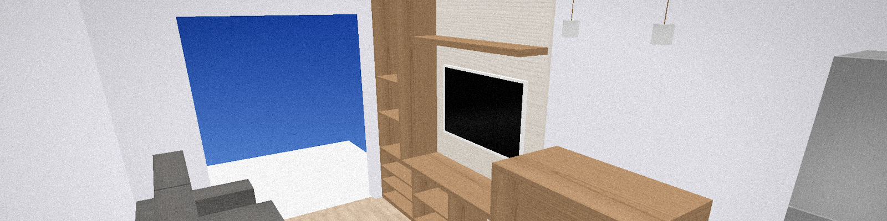

# Cobogo OpenGL Architecture

A C++17 and OpenGL application that presents an interactive 3D architectural environment. The scene combines modeled rooms, furniture, lighting, textured materials, a navigable first-person camera and optional structural views.

The rendering pipeline uses GLFW for window and input management, GLEW for OpenGL function loading, GLM for vector and matrix operations, and GLSL shaders for objects, the grid, the sky, and post-processing. Texture loading is handled by the bundled `stb_image` implementation.

## Install and run on Windows

1. Download the ZIP from the latest release and extract all its files into one folder.
2. Open the extracted folder and run `cobogo-opengl-architecture.exe`.

## Controls

| Input | Action |
| --- | --- |
| Mouse | Look around |
| `W` / `S` | Move forward or backward |
| `A` / `D` | Move left or right |
| `Q` / `E` | Move up or down |
| `G` | Toggle the reference grid |
| `F` | Toggle wireframe rendering |
| `H` | Show or hide walls |
| `B` | Toggle the background mode |
| `Esc` | Close the application |

## Requirements

- CMake 3.21 or later
- Ninja
- OpenGL 3.3-compatible graphics hardware and driver
- GLFW
- GLEW
- GLM

### Windows with MSYS2

From an MSYS2 UCRT64 terminal:

```bash
pacman -S --needed git mingw-w64-ucrt-x86_64-toolchain mingw-w64-ucrt-x86_64-cmake mingw-w64-ucrt-x86_64-ninja mingw-w64-ucrt-x86_64-glfw mingw-w64-ucrt-x86_64-glew mingw-w64-ucrt-x86_64-glm
```

OpenGL itself is provided by the graphics driver on Windows. Keep the GPU driver updated to obtain the OpenGL version supported by the hardware.

Run the CMake commands below from the same **MSYS2 UCRT64** terminal. A regular PowerShell session may select another MinGW installation, such as `C:\mingw64`, which cannot find packages installed under `C:\msys64\ucrt64`.

To build from PowerShell instead, place the UCRT64 tools first in the current session's `PATH`:

```powershell
$env:Path = "C:\msys64\ucrt64\bin;C:\msys64\usr\bin;$env:Path"
```

Confirm that the correct CMake is active before configuring:

```powershell
Get-Command cmake
```

The command should report `C:\msys64\ucrt64\bin\cmake.exe`.

### Debian and Ubuntu

```bash
sudo apt update
sudo apt install git build-essential cmake ninja-build libgl1-mesa-dev libglfw3-dev libglew-dev libglm-dev
```

## Build

Create an optimized build from the repository root:

```bash
cmake --preset release
cmake --build --preset release
```

CMake copies the shaders and textures beside the executable automatically.

## Visual Studio Code

Install the Microsoft **C/C++** and **CMake Tools** extensions. On Windows, open the repository from an MSYS2 UCRT64 terminal:

```bash
cd /c/path/to/cobogo-opengl-architecture
code .
```

To debug, open the command palette, run **CMake: Select Configure Preset**, select **Debug**, add a breakpoint, and start **CMake: Debug**.

Make sure the CMake Tools output references `C:\msys64\ucrt64` instead of another MinGW installation.

## Code::Blocks

Code::Blocks can use a project generated by CMake, so machine-specific IDE files do not need to be committed. On Windows, install the UCRT64 version:

```bash
pacman -S --needed mingw-w64-ucrt-x86_64-codeblocks
```

Generate the project from the repository root:

```bash
cmake -S . -B build/codeblocks -G "CodeBlocks - Ninja" -DCMAKE_BUILD_TYPE=Debug
```

Open `build/codeblocks/cobogo-opengl-architecture.cbp` in Code::Blocks. If the debugger is not detected automatically, configure it to use `C:\msys64\ucrt64\bin\gdb.exe`.
